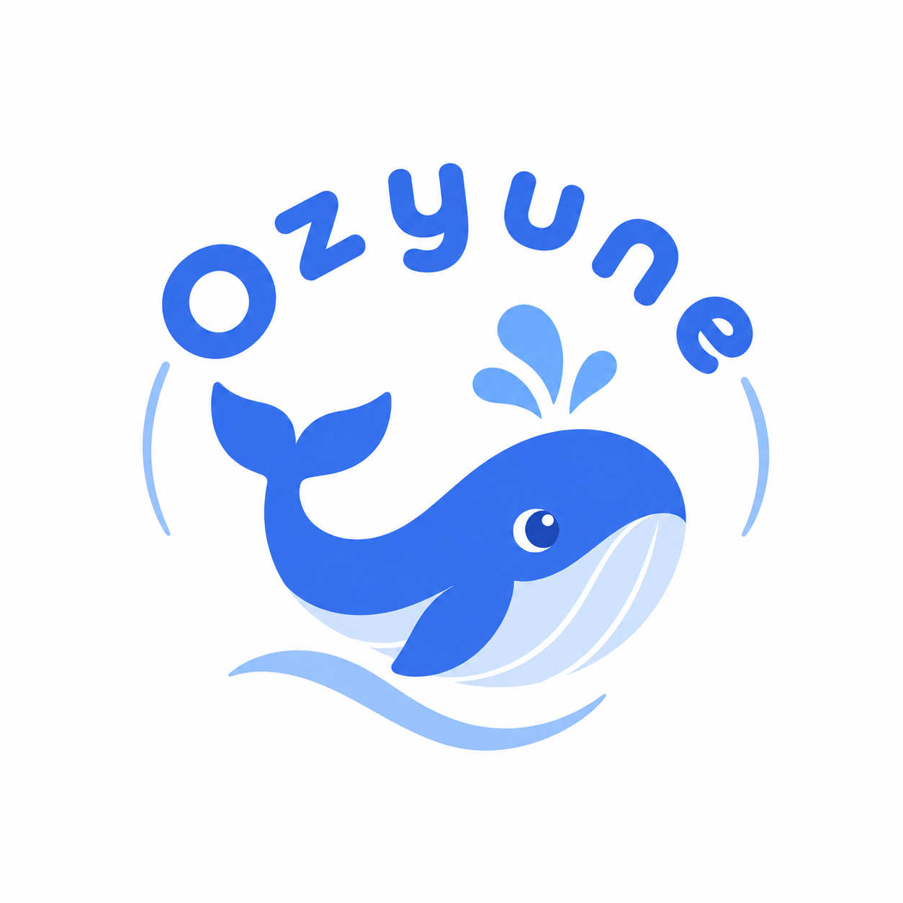

<p align="center">
  
</p>

<h1 align="center">Ozyune</h1>

<p align="center">
  一个轻量的原生 macOS 容器，为 <code>dsh web</code> 而生。
</p>

<p align="center">
  <strong>原生启动。内嵌 Web 界面。极简表面。</strong>
</p>

<p align="center">
  <a href="README.md">English</a> | 简体中文
</p>

## 概览

Ozyune 是一个小型 macOS 应用，把现有的 `dsh web` 体验装进原生应用窗口。

第一个版本刻意只做三件事：

- 启动 Ozyune 时拉起 `dsh web --no-open --port 0`；
- 在原生 `WKWebView` 中显示 dsh Web UI；
- 退出 App 时停止由它管理的 dsh 进程。

Ozyune **不会**重新实现 dsh 的界面或 agent 运行时。目标是让原生外壳保持轻薄，Web 应用和运行时行为继续由 dsh 自己负责。

> Ozyune 是独立项目，并非 DeepSeek 官方应用。

## 当前状态

**v1.0.0 —— 首个公开版本**

当前构建刻意保持极简：没有原生会话列表、菜单栏组件、内置 Node 运行时、自动更新，也没有定制的 dsh UI。

## 前置条件：先安装 DeepSeek Harness

> **重要** —— Ozyune 只是一个外壳，**不内置** dsh 运行时。启动 Ozyune 之前，必须先在你的 Mac 上下载并安装好 [DeepSeek Harness](https://www.npmjs.com/package/@deepseek-ai/dsh)。

使用 npm 全局安装（需要 Node.js 18 或更高版本）：

```bash
npm install --global @deepseek-ai/dsh
```

然后验证安装：

```bash
dsh --version
```

Ozyune 通过你的登录 shell 启动 dsh（`npx --yes @deepseek-ai/dsh web --no-open --port 0`）。预装好 dsh 后启动几乎是瞬时的；否则首次启动会卡在 `npx` 下载包的过程中，在网络较慢或受限的环境下可能直接失败。

## 系统要求

- macOS 14 或更高版本
- 已安装 DeepSeek Harness（见上文）
- shell 环境中可用的 Node.js 和 `npm` / `npx`
- 当 `npx` 需要解析或下载 `@deepseek-ai/dsh` 时的网络访问
- Xcode 16 或更高版本 —— 仅从源码构建时需要

## 本地运行

1. 克隆本仓库。
2. 用 Xcode 打开 `Ozyune.xcodeproj`。
3. 选择 `Ozyune` scheme。
4. 运行目标选择 **My Mac**。
5. 点击 **Run**。

Ozyune 当前执行的是：

```bash
npx --yes @deepseek-ai/dsh web --no-open --port 0
```

它会等待 dsh 的就绪 URL，然后直接在 `WKWebView` 中加载，不会打开外部浏览器。

### 本地构建的签名配置

项目使用自动签名，但你的 Apple Developer Team ID 不会进入 git。克隆仓库后，请在仓库根目录创建 `Local.xcconfig`（该文件已被 gitignore）：

```
DEVELOPMENT_TEAM = <你的-team-id>
```

`Signing.xcconfig` 以可选方式包含这个文件；没有它时构建就不指定 team。

## 架构

```text
Ozyune.app
├── OzyuneProcessManager
│   ├── 启动 dsh
│   ├── 监听 stdout / stderr
│   ├── 检测就绪 URL
│   └── 负责进程清理
│
└── OzyuneWebView
    └── WKWebView
        └── dsh Web UI
```

关于当前的边界与生命周期规则，见 [`docs/architecture.md`](docs/architecture.md)。

## 项目结构

```text
Ozyune/
├── .github/
│   ├── ISSUE_TEMPLATE/
│   ├── pull_request_template.md
│   └── workflows/build.yml
├── design/
│   └── ozyune-logo.png
├── docs/
│   └── architecture.md
├── Ozyune.xcodeproj/
├── Ozyune/
│   ├── AppDelegate.swift
│   ├── Assets.xcassets/
│   ├── ContentView.swift
│   ├── DshOutputInterpreter.swift
│   ├── Info.plist
│   ├── OzyuneApp.swift
│   ├── OzyuneProcessManager.swift
│   ├── OzyuneWebView.swift
│   └── StartupView.swift
├── Signing.xcconfig          # 已提交；以可选方式包含 Local.xcconfig
├── Local.xcconfig            # 已 gitignore；你的 DEVELOPMENT_TEAM 放这里
├── CONTRIBUTING.md
├── LICENSE
└── README.md
```

## 设计原则

- **薄原生外壳** —— 没有明确理由，不在 Swift 里重复实现 dsh 的业务逻辑。
- **原生用在关键处** —— 生命周期、窗口、文件对话框以及未来的 macOS 集成，属于应用外壳。
- **沿用已可用的 Web** —— 现阶段现有 dsh Web UI 继续作为产品界面。
- **小步快跑** —— 新的原生特性必须解决一个具体的限制，而不是默认让外壳膨胀。

## 路线图

近期可能的方向（非承诺）：

- 内置受控的 Node + dsh 运行时，不再依赖用户的 shell 环境；
- 改进原生的启动 / 故障恢复诊断；
- 只在能实质改善体验的地方加入 macOS 特定集成；
- 开始分发时，补齐签名、公证、打包与更新投递。

## 贡献

见 [`CONTRIBUTING.md`](CONTRIBUTING.md)。

## 许可证

Ozyune 基于 [MIT 许可证](LICENSE) 发布。
